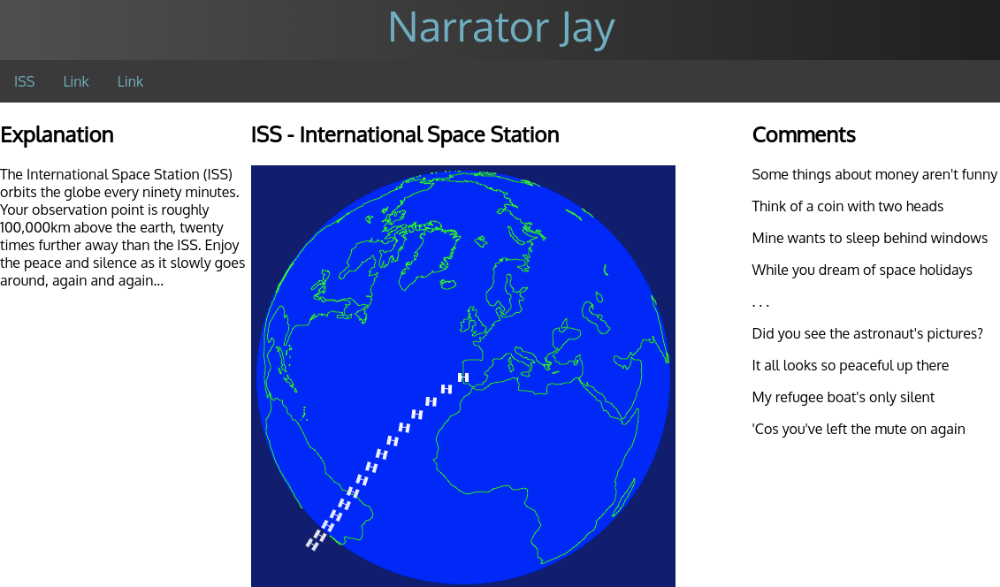

# Space Holidays
 *API call for co-ordinates requires http, not https, call*

I have these aims with this upgrade to the live ISS animation displayed at http://narratorjay.me

- Use Git throughout
- Update ISS icon by the replacing the current 'two white squares with a blue rectangle' 
   to 'three white rectangles' allowing coastlines to show through the solar panels
	*successful, easily accomplished with minimal co-ordinate alterations*
- Decrease the incremental fading of each historic ISS position
	*successful, provides up to three visible tracks and an extra longitude tweak displays ISS position beyond earth's curvature*
- Improve the appearance of the fading track of recent ISS positions to a fixed transparency (alpha value) instead of cycling through dimming icon positions
	*successful, longer fading trail lasting about twelve hours before restarting*
- Add refugee camp locations
	*researched locations, decided against adding them;  instead I uploaded short poem contrasting fortunes of astronauts and refugees*
- Deleted old Drupal contents that were no longer needed

